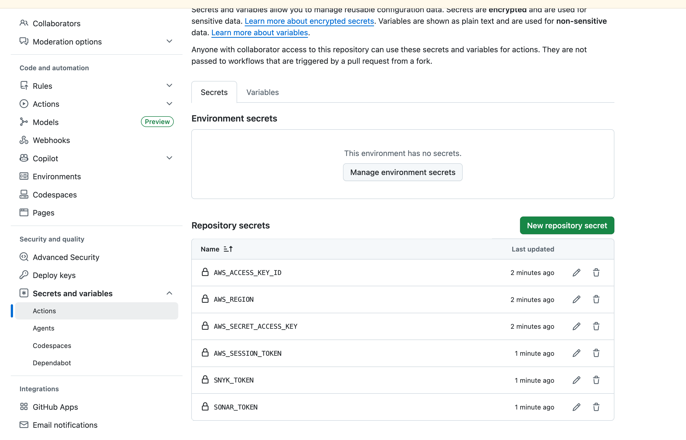

# Crear repositorio

1. Ir a github
2. Crear repositorio

## Crear los siguientes secretos

## Los secretos

|  `AWS_ACCESS_KEY_ID`    |  |  |
| :------------------------ | - | - |
| `AWS_REGION`            |  |  |
| `AWS_SECRET_ACCESS_KEY` |  |  |
| `AWS_SESSION_TOKEN`     |  |  |
| `SNYK_TOKEN`            |  |  |
| `SONAR_TOKEN`           |  |  |
